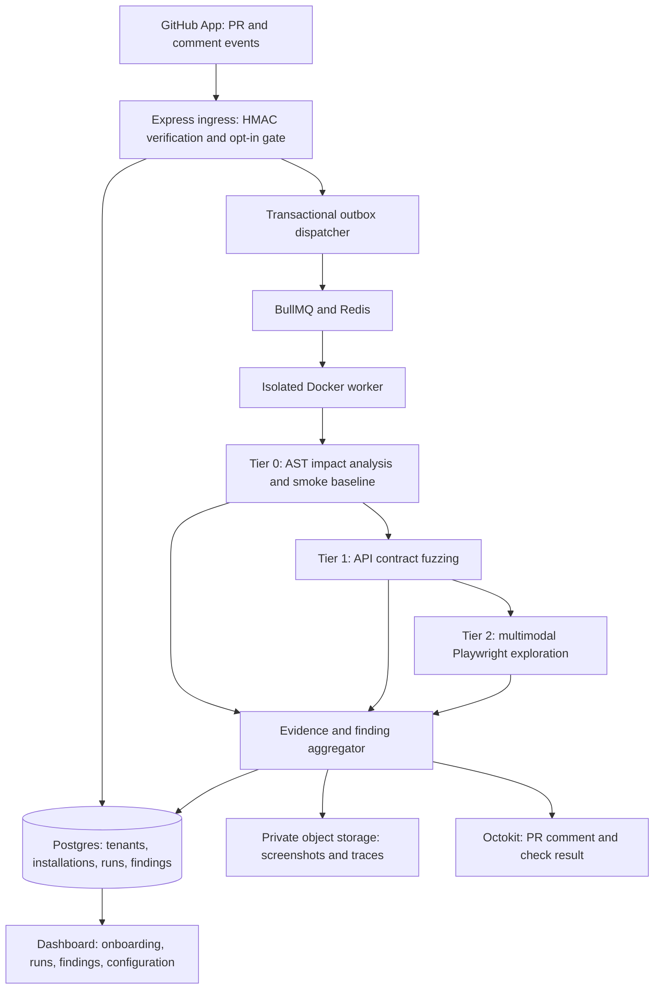

# DogWatch — Autonomous AI QA Engineer

## Product objective

Build a multi-tenant SaaS developer tool that autonomously evaluates opted-in GitHub pull requests. DogWatch combines AST blast-radius analysis, server-side API contract fuzzing, and multimodal browser exploration to identify regressions before merge and publish evidence-backed GitHub reports.

DogWatch performs **Autonomous Synthetic Persona & Chaos QA**. It is a pre-filter for human testing and dogfooding, not a replacement for them. Catching 90% of regressions is a product aspiration to validate against a labeled benchmark, not an initial accuracy guarantee.

This roadmap translates the master specification into an implementation plan. Technology choices beyond the specified Express, BullMQ, Redis, Postgres, Docker, Playwright, and Octokit are proposed defaults. Phase gates determine readiness; calendar estimates should follow implementation and benchmark evidence.

## How a user will use DogWatch

DogWatch will be a **hosted website connected to a GitHub App**. The website is where users set it up and review detailed results. The GitHub App is the connection that lets DogWatch receive PR events and post results back to GitHub. It is installed on selected repositories through GitHub, rather than installed as a browser or editor extension.

### First-time setup

1. A developer visits the DogWatch website and signs in with GitHub.
2. They install the DogWatch GitHub App on their personal account or organization and choose which repositories it can access. Organization approval may be needed.
3. They select a connected repository in the dashboard. A repository link can help identify it, but pasting a link alone does not grant access or make the application runnable.
4. They configure how DogWatch finds the **PR preview URL**: a temporary running version of the application containing that PR's changes. Their existing deployment pipeline creates this preview; automatic deployment of arbitrary repositories is outside the initial MVP.
5. They supply an API contract when available, synthetic test accounts, important journeys such as login and checkout, and testing limits. An API contract is a document describing valid API requests and responses. Test accounts give DogWatch the access it needs to try those journeys.
6. They choose the opt-in trigger. Example names in this document are the `dogwatch` PR label and the `/dogwatch run` comment command; these are proposed defaults to finalize during implementation.

### Everyday use

The developer opens a PR as usual. When they want QA, they add the configured label or post the configured command. DogWatch tests the preview in the background and posts its findings on the PR. The developer opens the dashboard only when they want more evidence, run history, configuration changes, cancellation, or a rerun.

The main experience is therefore: **connect once on the website → request testing in GitHub → read the report in GitHub → inspect details on the website when needed**. A browser extension or VS Code extension could be added later, but neither is required for this workflow.

## Design architecture

### The diagram explained with one simple example

Imagine Maya maintains an online shop called **PawMart**. She opens PR **#42** to change the checkout form and order API. Her deployment pipeline creates a preview containing those changes. She adds the `dogwatch` label to ask DogWatch to test it.

The boxes in the diagram are **components**, each with a job. A run's **state** is its current progress, such as waiting or running; those states are explained separately below. This example describes the planned behavior, not functionality already implemented.

#### 1. GitHub App — the messenger

GitHub sends DogWatch a message saying, “Maya added the testing label to PawMart PR #42.” This message is called a webhook. It contains information identifying the repository, PR, and event. The App connection also lets DogWatch read authorized PR information and eventually post a report.

#### 2. Express ingress API — the front desk

The API checks that the message really came from GitHub, that PawMart is connected to Maya's organization, and that this event requests testing. The signature check is like checking a tamper-proof seal on a delivery.

An ordinary PR without the testing label or an authorized command is ignored. For an eligible request, the API records the work and quickly tells GitHub, “Message received.” It does not keep GitHub waiting while the tests run.

#### 3. Postgres — the permanent notebook

Postgres stores which organization owns PawMart, its testing settings, and the new run for PR #42. It records the exact code version so the results can be tied to the changes that were actually tested.

As the run progresses, this notebook records its status, findings, and usage. After completion, it provides the history shown in the dashboard. Different organizations have separate access to their records.

#### 4. Transactional outbox dispatcher — the reliable handoff

When the API records the run, it also records a “send this run to the queue” instruction in the same database transaction. This means either both records are saved or neither is saved.

The dispatcher reads that instruction and hands it to the queue. If it crashes during the handoff, it can retry using the same job identity. Maya's accepted request is not silently lost or turned into two separate runs.

#### 5. BullMQ and Redis — the waiting line

The queue holds PR #42's job until testing capacity is available. If several teams request tests at once, it manages how many jobs run together and keeps each team within its limits.

It can retry temporary problems, such as a brief service outage. It stops retrying after the configured limit, rather than running forever.

#### 6. Isolated Docker worker — the testing room

A worker takes the job and prepares a restricted environment for it. Think of this as a separate testing room with limited time, memory, network access, and credentials.

The worker finds PR #42's preview and waits for it to become ready within a time limit. It uses disposable test accounts and data. A missing or unreachable preview produces a clear setup outcome rather than a claim that checkout passed.

#### 7. Tier 0 — decide where to look and check the basics

**AST blast-radius analysis** reads the changed code's structure and connections. For PR #42, it notices that the checkout form uses a changed order helper, so both checkout and order creation deserve attention. “Blast radius” simply means which other areas a change might affect.

The **smoke baseline** tries the most important basics within a 20-second test budget: can the site load, can the test user log in, and can checkout open? This budget does not include waiting for the preview to start. When a comparable base version is available, DogWatch can check whether a failure also existed before Maya's changes.

#### 8. Tier 1 — test the server directly

DogWatch sends requests straight to the order API without clicking through the website. Using the contract and configured permissions, it tries cases such as a missing address, an invalid quantity, no login, or one test user requesting another test user's order.

Suppose a missing address crashes the server with a `500` response instead of returning the documented validation error. DogWatch records the request and response as evidence. A correctly rejected unauthenticated request is expected behavior, not automatically a bug.

#### 9. Tier 2 — use the website like a test shopper

Playwright opens a browser on the preview. DogWatch gives the AI a screenshot and a structured description of visible controls, such as “Address textbox” and “Place order button.” The AI suggests an action, and the executor checks that it is allowed before performing it.

The loop is: **look at the page → choose an action → validate it → perform it → look again**. DogWatch also listens for browser errors and failed network requests throughout this loop.

For example, it fills the basket and submits checkout with a blank address. Suppose checkout becomes stuck on “Processing…” after the API fails. DogWatch captures that behavior and tries to reproduce it. It can also try configured scenarios such as slow connections or repeated clicks, while staying within its limits.

#### 10. Evidence and finding aggregator — assemble the case

The aggregator gathers results from all three tiers. It links the missing-address API failure with the stuck checkout screen where the evidence supports that connection, so Maya gets a coherent finding rather than several unrelated error messages.

It explains what was tested, what went wrong, how to reproduce it, and how confident DogWatch is. If the base preview was unavailable, it says the problem was observed on PR #42 but cannot confidently claim that Maya introduced it.

#### 11. Private object storage — the evidence cupboard

Screenshots and browser traces go into private file storage. Postgres holds their references and metadata. This keeps large files separate from the run records.

Maya can inspect the evidence through authorized dashboard access or suitable expiring links. Secrets are redacted, and artifacts expire according to the retention policy.

#### 12. Octokit reporting — return the result to GitHub

Octokit is the library DogWatch uses to communicate with GitHub. It posts a PR comment and updates a check result for the tested code version.

An example comment could say: “Checkout fails when the address is empty. The order API returns 500, and the page remains on Processing. Steps: log in with the test account, add an item, leave the address blank, and submit.” It includes evidence links and any testing limitations. Whether this blocks merging depends on the repository's configured policy.

#### 13. Dashboard — the user's control panel

Maya can open the DogWatch website to see PR #42's progress, read the full findings, view screenshots and traces, and inspect time and usage. She can also configure future runs or request an authorized rerun.

After fixing checkout, Maya pushes a new commit. The old result remains attached to the old code version. It is superseded for current PR status, and testing the new version follows the configured opt-in and rerun policy.

### Overall flow in plain language

**Maya asks for testing in GitHub → DogWatch verifies and saves the request → the queue assigns a worker → the worker waits for the preview → DogWatch checks changed code and basic health → it tests the API → it explores the website → it combines the evidence → it posts a GitHub report and saves details for the dashboard.**

Postgres, artifact storage, and the dashboard support this flow rather than being extra tests. A blocking failure can prevent later checks from running; the report must explain what was skipped.

### Run states in plain language

| State                 | What it means                                                                             | Example for PR #42                                                               |
| --------------------- | ----------------------------------------------------------------------------------------- | -------------------------------------------------------------------------------- |
| `received`            | An eligible request has been saved durably.                                               | DogWatch has accepted Maya's testing request.                                    |
| `queued`              | The job is waiting for execution capacity.                                                | Other jobs are running, so PR #42 is waiting its turn.                           |
| `waiting_for_preview` | The job is checking whether the application is ready to test.                             | The worker has started setup, but PawMart's preview is still deploying.          |
| `running`             | One or more testing tiers are executing.                                                  | DogWatch is testing the order API and checkout page.                             |
| `reporting`           | Results are being assembled and published.                                                | DogWatch is preparing the checkout finding and updating GitHub.                  |
| `completed`           | The run finished and its report was published. This does not mean the application passed. | The completed report contains a checkout bug.                                    |
| `failed`              | DogWatch could not finish the run after its allowed recovery attempts.                    | The preview never became available, or report publication exhausted its retries. |
| `cancelled`           | An authorized user or configured policy stopped the run.                                  | Maya cancels testing because she is replacing the implementation.                |
| `superseded`          | A newer PR code version has made this run obsolete as the current verdict.                | Maya pushes a fix, so the old run no longer represents the latest checkout code. |

The usual path is `received → queued → waiting_for_preview → running → reporting → completed`. Preview-ready jobs can move directly from `queued` to `running`. Transient errors may cause bounded retries or requeuing; cancellation, supersession, and unrecoverable errors lead to the corresponding terminal state.

Run progress and test results are different: a run can be `completed` while finding serious bugs. Individual checks can pass, fail, be skipped, or be inconclusive. The report should show both the run's progress and the testing outcome.

### Execution lifecycle

1. Verify the webhook signature against the raw request body and validate event shape.
2. Apply installation authorization and opt-in rules. Ignore ordinary PRs; accept configured labels or commands from authorized users.
3. Persist a run and an outbox event in one transaction, then acknowledge within the target of **10 seconds**. Dispatch durable work to BullMQ asynchronously.
4. Resolve the immutable PR head SHA, preview URL, API contract, test accounts, and run budget. Wait for preview readiness within a bounded timeout.
5. Execute Tier 0, Tier 1, and Tier 2 inside an isolated worker, preserving evidence and explicit skipped or inconclusive outcomes.
6. Normalize and deduplicate findings, verify reproducibility where practical, and publish a structured PR report.
7. Record the final state and cost. Cancel or supersede obsolete runs when a newer PR head arrives.

### Core design principles

- **Tenant isolation:** Scope every installation, configuration, run, artifact, and credential to a tenant. Enforce authorization in the API, workers, storage access, and database policies.
- **Evidence over inference:** Separate observed failures, reproducible regressions, heuristic security findings, and advisory UX observations. Missing context produces an inconclusive result.
- **Bounded autonomy:** Enforce allowed targets, actions, network destinations, runtime, requests, browser steps, and model spend outside the LLM.
- **Safe test environments:** Explore designated previews with synthetic accounts and disposable data. Gate destructive actions and security probes through explicit repository configuration.
- **Durable execution:** Assume at-least-once delivery. Use idempotent job stages and report publishing; retries must not duplicate side effects.
- **Untrusted inputs:** Repository content, DOM text, screenshots, and API responses are task data, never instructions that can override worker policy.

## Tools and technology stack

| Layer                  | Tools / technology                                                  | Objective                                                                                                                                                   |
| ---------------------- | ------------------------------------------------------------------- | ----------------------------------------------------------------------------------------------------------------------------------------------------------- |
| Shared language        | TypeScript, Node.js                                                 | Share validated domain types across ingress, workers, integrations, and dashboard.                                                                          |
| Workspace              | npm workspaces                                                      | Organize applications and shared packages without coupling their deployment lifecycles.                                                                     |
| Ingress / control API  | Express, Zod                                                        | Verify raw-body webhooks, validate inputs, expose authorized configuration and run APIs.                                                                    |
| GitHub integration     | GitHub App, Octokit                                                 | Receive scoped events, obtain short-lived installation tokens, read PR metadata, and publish reports.                                                       |
| Queue                  | BullMQ, Redis                                                       | Dispatch jobs with bounded concurrency, backoff, retries, cancellation, and operational visibility.                                                         |
| Persistent data        | PostgreSQL, Prisma, SQL migrations                                  | Store tenant-scoped run history, findings, budgets, configuration, and transactional outbox records. Use SQL where database policies need explicit control. |
| Worker isolation       | Docker, Playwright browser image                                    | Run browser and analysis workloads with resource limits, restricted privileges, and controlled network access.                                              |
| Change analysis        | Git diff, TypeScript Compiler API                                   | Map changed symbols and imports to affected modules; initially support JavaScript and TypeScript repositories.                                              |
| API testing            | OpenAPI contracts, Ajv, Node.js fetch                               | Validate schemas, construct bounded fuzz cases, and compare actual responses with expected contracts.                                                       |
| Browser automation     | Playwright                                                          | Capture accessibility-oriented snapshots, screenshots, traces, console failures, page exceptions, and response errors.                                      |
| Agent planning         | Multimodal LLM API, Zod action schemas                              | Interpret browser state and select structured actions; keep model access behind a provider adapter.                                                         |
| Artifact storage       | S3-compatible private object storage                                | Retain screenshots and traces with tenant-scoped access, lifecycle expiration, and signed download links.                                                   |
| Dashboard              | Next.js, React, Tailwind CSS                                        | Provide installation onboarding, run inspection, evidence review, budgets, and repository policy controls.                                                  |
| Authentication         | GitHub OAuth / verified session library                             | Authenticate dashboard users; verify tenant membership independently of GitHub App installation access.                                                     |
| Observability          | OpenTelemetry, structured JSON logs, metrics backend                | Trace webhook-to-report execution and measure reliability, latency, model usage, and cost.                                                                  |
| Verification           | Vitest, Supertest, Playwright, seeded fixture apps                  | Test webhook security, tenancy, orchestration, known regressions, and browser workflows.                                                                    |
| CI / local development | GitHub Actions, Docker Compose                                      | Run checks, build images, and provide reproducible local Postgres, Redis, and application services.                                                         |
| Deployment             | Managed Postgres, managed Redis, container platform, secret manager | Operate the control plane and workers independently with backups, secret rotation, and scaling. Select the provider before production deployment.           |

## Incremental implementation and approval workflow

Implementation follows one small phase at a time. After each phase, update `tech.md`, `direction.md`, and `flow.md`, run relevant verification, and provide a commit message covering all pending changes. Stop until the user approves the next phase. Do not automatically commit.

The original phase descriptions below remain the design scope. The execution steps subdivide them; the user's requested initial setup is implementation **Part 1, Phase 1.1**.

| Part           | Small implementation phases, in order                                                                                                                                                                                                                 |
| -------------- | ----------------------------------------------------------------------------------------------------------------------------------------------------------------------------------------------------------------------------------------------------- |
| 1 — Foundation | **1.1 Initial workspace and runnable shells (current)**; 1.2 Domain contracts and opt-in policies; 1.3 Threat model and architecture decisions; 1.4 Local Postgres/Redis and migrations; 1.5 CI and fixture application.                              |
| 2 — Ingress    | 2.1 GitHub App configuration and raw-body verification; 2.2 Authorization and event filtering; 2.3 Delivery deduplication and outbox; 2.4 Queue dispatch and retries; 2.5 Cancellation and supersession; 2.6 Preview readiness; 2.7 Worker isolation. |
| 3 — Tier 0     | 3.1 Immutable diff retrieval; 3.2 Import and symbol graph; 3.3 Route impact mapping; 3.4 Smoke journeys; 3.5 Base comparison and evidence.                                                                                                            |
| 4 — Tier 1     | 4.1 Contract validation; 4.2 Deterministic boundary cases; 4.3 Request execution and limits; 4.4 Authentication probes; 4.5 Role and ownership probes; 4.6 Cleanup and reproducibility.                                                               |
| 5 — Tier 2     | 5.1 Browser observation; 5.2 Validated action executor; 5.3 Model adapter and loop; 5.4 Personas and budgets; 5.5 Controlled chaos; 5.6 Failure replay.                                                                                               |
| 6 — Reporting  | 6.1 Finding schema; 6.2 Deduplication; 6.3 Private artifacts; 6.4 Markdown report; 6.5 GitHub comments and checks; 6.6 Stale-result handling.                                                                                                         |
| 7 — SaaS       | 7.1 Login and membership; 7.2 Installation linking; 7.3 Tenant isolation verification; 7.4 Onboarding; 7.5 Run and evidence views; 7.6 Configuration and reruns; 7.7 Usage ledger and quotas.                                                         |
| 8 — Release    | 8.1 Logs and tracing; 8.2 Metrics and alerts; 8.3 Recovery drills; 8.4 Labeled benchmark; 8.5 Security validation; 8.6 Deployment; 8.7 Portfolio documentation and pilot.                                                                             |

Each step inherits the corresponding objectives and completion gates below. Expand its concrete acceptance criteria before implementation. Phase 1.1 delivers only the workspace, API health endpoint, informational web shell, worker entry point, and documentation; it does not implement QA execution.

## Part 1 — Product foundation and local platform

### Phase 1.1 — Scope, policies, and contracts

**Objective:** Define what an initial DogWatch run can safely do and what its output means.

- Document the opt-in label and comment command, authorized actors, supported repository languages, and preview requirements.
- Define run states: `received`, `waiting_for_preview`, `queued`, `running`, `reporting`, `completed`, `failed`, `cancelled`, and `superseded`.
- Define finding severity, confidence, evidence requirements, tier outcomes, budgets, and cancellation behavior.
- Start with preview environments, OpenAPI-backed APIs, and configured synthetic test identities.
- Write the threat model and initial architecture decision records.

**Tools:** Markdown ADRs, TypeScript domain types, Zod.

**Completion gate:** Sample webhook, configuration, job, and report payloads agree on tenant identity, PR SHA, run budgets, and outcomes.

### Phase 1.2 — Repository and local services

**Objective:** Make the project runnable and verifiable from a clean checkout.

- Create `apps/api`, `apps/worker`, `apps/web`, and shared packages for contracts, database access, analysis, and reporting.
- Configure linting, formatting, type checking, environment validation, and CI.
- Add Docker Compose for Postgres and Redis, migrations, seed data, and a fixture preview application.

**Tools:** npm workspaces, TypeScript, Docker Compose, Prisma, GitHub Actions, Vitest.

**Completion gate:** A documented setup starts local services and passes the initial CI checks without production credentials.

## Part 2 — GitHub ingress and durable orchestration

### Phase 2.1 — GitHub App and decision gate

**Objective:** Accept only authentic, authorized, opted-in PR work.

- Configure minimum GitHub App permissions and the required PR, comment, and installation events.
- Verify `x-hub-signature-256` using raw bytes and a constant-time comparison.
- Handle opened PRs carrying the configured label, newly labeled PRs, and authorized comment commands.
- Deduplicate webhook delivery IDs; reject unsupported events and unauthorized commands.
- Resolve repository installation, PR number, head SHA, and event identity without trusting user-provided routing fields.

**Tools:** Express, Octokit, Zod, Supertest.

**Completion gate:** Signed fixtures trigger eligible runs; invalid signatures, normal PRs, repeated deliveries, and unauthorized commands do not create extra work.

### Phase 2.2 — Durable queue and run state

**Objective:** Survive restarts and retries without losing or duplicating accepted work.

- Persist runs and transactional outbox records; use a dispatcher to enqueue stable job IDs.
- Add global and tenant concurrency limits, transient-failure backoff, retry ceilings, and failed-job inspection.
- Enforce state transitions, cancellation, stale-head supersession, and idempotent stage checkpoints.
- Treat policy violations and deterministic configuration errors as terminal rather than retryable.

**Tools:** Postgres, Prisma, BullMQ, Redis.

**Completion gate:** Crash and duplicate-delivery tests preserve accepted jobs and prevent duplicate reports; acknowledgments meet the 10-second target under the defined test load.

### Phase 2.3 — Preview readiness and isolated execution

**Objective:** Run against the intended preview with enforceable boundaries.

- Obtain preview URLs from trusted deployment metadata or explicit repository configuration.
- Bound readiness polling and revalidate destination rules across redirects and resolved addresses.
- Use containers without privileged mode or Docker socket access, with CPU, memory, runtime, filesystem, and egress restrictions.
- Inject short-lived, least-privilege credentials and scrub logs and artifacts of secrets.

**Tools:** Docker, Octokit deployment APIs, network policy controls, secret manager adapter.

**Completion gate:** An eligible queued run reaches a ready fixture preview; forbidden destinations and exhausted budgets stop execution with clear outcomes.

## Part 3 — Tier 0: AST blast radius and baseline

### Phase 3.1 — Change impact analysis

**Objective:** Prioritize exploration around changed code and plausible dependencies.

- Retrieve PR diff and source at immutable SHAs; handle renamed and deleted files.
- Parse JavaScript and TypeScript imports, exports, symbols, and dependency edges.
- Map affected modules to configured routes, API operations, and critical journeys.
- Mark dynamic imports, unsupported languages, generated code, and incomplete graphs as uncertain; widen coverage when needed.

**Tools:** Git diff, TypeScript Compiler API, repository route mappings.

**Completion gate:** Fixture PRs identify expected impacted modules and explain coverage gaps without implying complete impact detection.

### Phase 3.2 — Critical smoke baseline

**Objective:** Establish basic preview health before expensive exploration.

- Execute configured critical journeys with a **20-second execution budget**, excluding separately measured preview readiness and setup.
- Capture navigation, authentication, core interaction, console, page, and server failures.
- For regression attribution, run matching checks against an available base preview or compatible recorded baseline; disclose when comparison is unavailable.
- Stop dependent checks after blocking setup failures and retain the smoke evidence.

**Tools:** Playwright, synthetic fixture data, baseline storage.

**Completion gate:** Seeded smoke regressions are detected within budget and distinguished from setup failures and pre-existing failures when baseline evidence exists.

## Part 4 — Tier 1: Server-side API contract fuzzing

### Phase 4.1 — Contract ingestion and bounded cases

**Objective:** Generate meaningful edge cases from known API contracts.

- Ingest configured OpenAPI documents and validate supported schema constructs.
- Rank operations using blast-radius output and repository policy.
- Generate missing fields, invalid types, nulls, length and numeric boundaries, malformed bodies, and unexpected property cases.
- Apply request caps, rate limits, timeouts, deterministic seeds, and disposable-data setup and cleanup.
- Treat discovery without a contract as exploratory with explicitly weaker assertions.

**Tools:** OpenAPI, Ajv, fetch, deterministic generators.

**Completion gate:** Fixture APIs produce reproducible cases and contract violations without exceeding request or payload limits.

### Phase 4.2 — Authentication, role, and ownership probes

**Objective:** Detect configured authorization failures with defensible evidence.

- Test unauthenticated access against documented authentication expectations, including expected `401` behavior.
- Compare allowed and forbidden role actions, including configured `403` expectations.
- Probe IDOR using two synthetic identities and known resource ownership; require evidence of unauthorized access or mutation.
- Flag unexpected `5xx` responses and schema failures; do not label every `4xx` response as a bug.
- Redact sensitive request and response fields and clean up synthetic resources.

**Tools:** fetch, credential broker, Ajv, fixture APIs.

**Completion gate:** Known authentication, role, and IDOR defects are detected; correctly denied requests pass and missing ownership context is inconclusive.

## Part 5 — Tier 2: Multimodal browser exploration

### Phase 5.1 — Browser observation and constrained actions

**Objective:** Give the agent a reliable view of the interface and a bounded action vocabulary.

- Collect accessibility-oriented snapshots and screenshots from Playwright using version-supported APIs.
- Record console errors, page exceptions, failed requests, and `4xx` / `5xx` responses with action timestamps.
- Define validated actions such as click, fill, select, scroll, navigate, and stop.
- Resolve targets through accessible roles and labels where possible; validate coordinate actions against the active viewport.
- Enforce origin, action, navigation, upload, download, and destructive-operation policy in executor code.

**Tools:** Playwright, Zod, private artifact storage.

**Completion gate:** Scripted action fixtures capture relevant failures; malformed or forbidden model actions cannot execute.

### Phase 5.2 — Multimodal agent and synthetic personas

**Objective:** Explore relevant journeys beyond fixed E2E scripts.

- Implement the loop: observe → select structured action → validate → execute → record → reassess.
- Supply the agent with impacted journeys, persona goals, expected behavior, and remaining budget.
- Add configured novice, keyboard-only, impatient, and unusual-input personas without inferring full accessibility compliance.
- Bound model calls, tokens, time, repeated actions, navigation loops, and exploration steps.
- Keep secrets out of prompts and defend against prompt injection through untrusted page content.

**Tools:** Multimodal LLM adapter, Playwright, action schemas, budget ledger.

**Completion gate:** The agent completes seeded journeys, detects known UI failures, and stops predictably on budget exhaustion or lack of progress.

### Phase 5.3 — Controlled chaos and reproduction

**Objective:** Identify resilience failures while keeping findings reproducible.

- Apply configured slow-network, offline, refresh, navigation interruption, repeated submission, and boundary-input scenarios.
- Replay suspected failures with a fresh browser context and controlled fixture state.
- Compare with the base preview when available to distinguish new regressions from existing issues.
- Record scenario settings, action sequence, screenshots, trace, and repeatability; classify unstable observations separately.

**Tools:** Playwright network controls, trace recording, fixture reset APIs.

**Completion gate:** Reports contain reproducible evidence or explicitly identify an observation as unconfirmed.

## Part 6 — Evidence aggregation and GitHub reporting

### Phase 6.1 — Finding normalization and triage

**Objective:** Convert tier outputs into a concise, trustworthy result.

- Normalize findings by tier, route or operation, severity, confidence, environment, and PR SHA.
- Deduplicate related failures across API, console, and browser evidence.
- Preserve reproduction steps, expected versus actual behavior, redacted payloads, and artifact references.
- Separate confirmed failures, possible regressions, advisory UX observations, and coverage gaps.
- Measure journey completion, failed actions, and observed timings; avoid unsupported universal UX scores.

**Tools:** TypeScript aggregation package, Postgres, object storage.

**Completion gate:** Fixture runs produce stable summaries and retain enough evidence to independently inspect each reported failure.

### Phase 6.2 — PR comments and checks

**Objective:** Put actionable findings into the developer's existing review workflow.

- Publish a structured Markdown PR comment containing outcome, findings, reproduction steps, screenshots, coverage, and budgets consumed.
- Update one tracked report per run or configured PR reporting policy; avoid retry-generated comment spam.
- Add a GitHub Check Run with queued, running, and final status and configurable blocking rules.
- Use a deliberate artifact access policy: expiring links for suitable previews, authenticated dashboard links for sensitive evidence.
- Suppress stale results as current verdicts when the head SHA changes.

**Tools:** Octokit, Markdown renderer, signed artifact URLs.

**Completion gate:** A complete fixture PR receives one useful report and matching check status; retries and superseded runs behave correctly.

## Part 7 — Multi-tenant SaaS experience

### Phase 7.1 — Identity, onboarding, and tenant isolation

**Objective:** Support independent organizations without cross-tenant access.

- Add GitHub login, organization membership, installation linking, and owner/member roles.
- Handle installation removal, suspended access, and membership changes.
- Enforce tenant-scoped queries, Postgres row-level policies where applicable, and artifact authorization.
- Store credentials encrypted and expose only references to workers.

**Tools:** Next.js, session library, GitHub OAuth, Postgres policies, secret manager.

**Completion gate:** Cross-tenant access tests fail across API endpoints, worker inputs, installation tokens, and artifact downloads.

### Phase 7.2 — Dashboard and repository configuration

**Objective:** Make setup, results, and run policy understandable.

- Build installation onboarding, repository selection, run lists, run details, findings, and evidence views.
- Configure preview resolution, contracts, journeys, synthetic identities, opt-in triggers, allowed actions, and budgets.
- Offer authorized manual reruns and cancellation with audit records.
- Design clear empty, waiting, failed, skipped, and inconclusive states.

**Tools:** Next.js, React, Tailwind CSS, Express control API.

**Completion gate:** A user can install DogWatch, configure a fixture repository, trigger a run, and inspect its report without editing infrastructure code.

### Phase 7.3 — Usage and quotas

**Objective:** Keep resource consumption visible and enforceable.

- Track browser runtime, request counts, model usage, storage, and per-run cost estimates.
- Reserve tenant budgets before dispatch and reconcile consumption at completion or failure.
- Set concurrency, daily usage, and retention limits with clear quota outcomes.
- Defer payments and subscription automation until pilot usage establishes useful pricing units.

**Tools:** Postgres usage ledger, BullMQ limits, model usage metadata.

**Completion gate:** Concurrent runs cannot bypass configured quotas and users can inspect their consumption.

## Part 8 — Reliability, evaluation, and release

### Phase 8.1 — Observability and recovery

**Objective:** Operate DogWatch with visible failure modes and recoverable state.

- Trace delivery ID, tenant, run, PR SHA, job, and report identifiers end to end.
- Measure queue delay, acknowledgment latency, tier duration, worker failures, report failures, and spend.
- Add health and readiness checks, alerts, backup/restore procedures, and failed-job recovery runbooks.
- Test worker termination, Redis interruptions, provider timeouts, GitHub rate limits, and storage failures.

**Tools:** OpenTelemetry, structured logs, metrics backend, failure-injection fixtures.

**Completion gate:** Defined failure scenarios recover or end explicitly, with sufficient evidence for an operator to diagnose them.

### Phase 8.2 — Quality benchmark and security validation

**Objective:** Demonstrate accuracy and isolation with measurable evidence.

- Build a labeled corpus of clean and broken PRs covering UI, API, authentication, ownership, and coupled-module regressions.
- Measure precision, recall by defect category, false positives, reproducibility, cost, and runtime over repeated runs.
- Compare deterministic smoke/API checks with the incremental contribution of the browser agent.
- Test prompt injection, SSRF, secret redaction, malicious repository inputs, tenant leakage, and artifact access.
- Publish limitations and benchmark methodology; assess the 90% aspiration only against a stated corpus and scope.

**Tools:** Seeded fixture repositories, Vitest, Playwright, benchmark scripts.

**Completion gate:** An agreed pilot quality threshold is met and security-critical isolation failures are resolved.

### Phase 8.3 — Deployment and portfolio release

**Objective:** Deliver an operable product and a convincing technical demonstration.

- Deploy separate API, dispatcher, dashboard, and worker services with managed data stores and private artifact storage.
- Configure TLS, secrets, migration strategy, backups, retention, resource limits, and scaling.
- Provide architecture docs, local setup, threat model, demo PRs, sample reports, benchmark results, and a recorded walkthrough.
- Pilot with a small number of repositories, tune from evidence, and document outstanding limitations.

**Tools:** Container platform, managed Postgres/Redis, object storage, GitHub Actions.

**Completion gate:** A live opted-in PR completes the full pipeline and operators can deploy, diagnose, and restore the system using documented procedures.

## Delivery milestones and dependencies

| Milestone                  | Required phases                   | Demonstrable outcome                                                               |
| -------------------------- | --------------------------------- | ---------------------------------------------------------------------------------- |
| M1 — Local foundation      | Part 1                            | Reproducible workspace, fixture application, validated contracts, and CI.          |
| M2 — Vertical slice        | Part 2, Phase 3.2, minimum Part 6 | An opted-in PR runs a smoke check and receives an evidence-backed report.          |
| M3 — API QA                | Phase 3.1 and Part 4              | Diff-prioritized contract and authorization checks with reproducible failures.     |
| M4 — Autonomous browser QA | Part 5 and complete Part 6        | Budgeted multimodal exploration, controlled chaos, and consolidated reporting.     |
| M5 — SaaS pilot            | Part 7 and Phase 8.1              | Authorized organizations configure repositories and review isolated runs.          |
| M6 — Flagship release      | Phases 8.2–8.3                    | Deployed product with benchmark evidence, demo PRs, and operational documentation. |

Build the smoke-to-report vertical slice before expanding AST coverage or agent sophistication. Authentication, tenant IDs, and worker boundaries belong in the initial data and execution model; Part 7 expands and validates them into full SaaS onboarding. Dashboard implementation can proceed once API contracts stabilize. Production release depends on both benchmark quality and isolation validation.

## Initial data model

| Entity                                | Purpose                                                                   |
| ------------------------------------- | ------------------------------------------------------------------------- |
| Tenant, User, Membership              | Organization ownership and user authorization.                            |
| Installation, Repository              | GitHub App scope and repository association.                              |
| RepositoryPolicy, CredentialReference | Versioned run configuration and references to protected secrets.          |
| WebhookDelivery, OutboxEvent          | Delivery deduplication and durable queue dispatch.                        |
| Run, TierExecution, RunEvent          | Immutable PR context, stage state, execution history, and cancellation.   |
| Finding, EvidenceArtifact             | Normalized observations, reproduction records, screenshots, and traces.   |
| Baseline                              | Base-SHA/environment context for comparable health and regression checks. |
| UsageReservation, UsageRecord         | Budget enforcement and actual consumption.                                |
| GitHubReport, AuditEvent              | Idempotent publication tracking and accountable configuration changes.    |

## MVP scope and later expansion

The MVP supports GitHub, configured preview URLs, JavaScript/TypeScript impact analysis, OpenAPI contracts, synthetic accounts, bounded browser exploration, and structured PR reporting. It includes tenant boundaries and run budgets from the start.

After the pilot, consider additional language analyzers, broader contract formats, richer persona libraries, more preview providers, historical flake classification, and subscription billing. Automated code fixes, unrestricted production exploration, exhaustive security certification, and claims of complete test coverage are outside the initial release.

## Definition of done

- An authentic, opted-in GitHub event produces a durable run against the correct PR preview and head SHA.
- All three tiers execute within configured policy and budgets, or report explicit reasons for skipping or stopping.
- Findings include redacted evidence, reproduction details, confidence, and baseline context where available.
- GitHub receives an idempotent report and an accurate final check outcome.
- Tenants cannot access each other's data, artifacts, credentials, or execution context.
- Operators can observe failures, recover jobs, and restore persisted data.
- Published benchmark results describe demonstrated detection quality, cost, runtime, and limitations.
